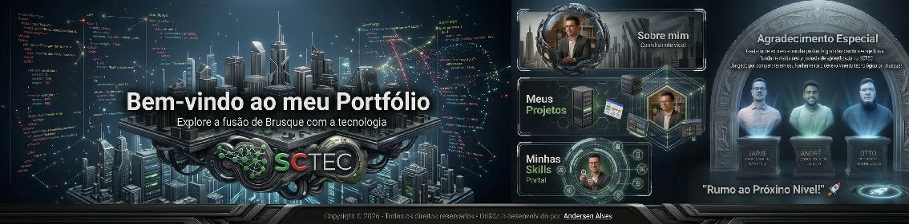

# 

  
  
  

# Documentação: Dashboard Interativo Profissional

Este projeto foi desenvolvido como requisito avaliativo para o curso **SCTEC (SESI/SENAI)**. A aplicação demonstra o domínio de fundamentos de Front-End, arquitetura de software e a criação de interfaces modernas com foco total na experiência do usuário (UX) e acessibilidade.

---

## 📌 Sumário
- [Sobre o Desenvolvedor](#-sobre-o-desenvolvedor)
- [Arquitetura Tecnológica](#-arquitetura-tecnológica)
- [Funcionalidades do Dashboard](#-funcionalidades-do-dashboard)
- [Projeto em Destaque: URBIX](#-projeto-em-destaque-urbix)
- [Instruções de Uso](#-instruções-de-uso)

---

## 👤 Sobre o Desenvolvedor
**Anderson Alves | Acadêmico de Análise e Desenvolvimento de Sistemas (ETEP)**

Profissional em transição de carreira focado no desenvolvimento Web e em soluções tecnológicas inteligentes. Atualmente, participo do programa **SCTEC** e das especializações do **Santander Jornada Tech (AWS)**. Minha abordagem une a bagagem em design gráfico à precisão do código para entregar interfaces funcionais e de impacto social.

---

## 🛠 Arquitetura Tecnológica

A construção do ecossistema baseou-se em três pilares fundamentais:

* **HTML5 Semântico:** Organização estrutural pensada em SEO e compatibilidade com leitores de tela.
* **CSS3 Moderno:** * **Flexbox:** Gestão de layout dinâmico e alinhamento do Dashboard.
    * **Media Queries:** Responsividade completa para adaptação entre Desktop e Mobile.
    * **Animações:** Uso de `@keyframes` para transições de conteúdo e feedback visual.
* **JavaScript (Vanilla JS):** * **Manipulação de DOM:** Atualização dinâmica de conteúdos sem necessidade de refresh.
    * **Lógica de Ativos:** Identificação da largura da tela para entrega de imagens otimizadas.
    * **Acessibilidade:** Gestão de estados para ferramentas de contraste e escala de texto.

  
  
  

---

## 💡 Funcionalidades do Dashboard

O sistema opera sob o conceito de **Single Page Application (SPA)**, onde quatro módulos de conteúdo são alternados dinamicamente:

1.  **Sobre Mim:** Relato sobre trajetória, transição de carreira e motivações.
2.  **Meus Projetos:** Exposição técnica, com destaque para a Landing Page IP 20h.
3.  **Minhas Skills:** Apresentação de competências técnicas (Hard Skills) e comportamentais (Soft Skills).
4.  **Formação Acadêmica:** Histórico educacional detalhando ETEP, SCTEC e aprendizado contínuo.

### ♿ Recursos de Inclusão (Acessibilidade)
* **Alto Contraste:** Ajuste cromático para usuários com sensibilidade visual.
* **Escalabilidade de Texto:** Controles de aumento (A+) e diminuição (A-) via scripts.
* **Navegação Ágil:** Inclusão de botões "Home" e "Voltar ao Topo" para fluidez na navegação.

---

## 🚀 Projeto em Destaque: URBIX
O **URBIX** é uma plataforma de **Inteligência Urbana Colaborativa** (fase MVP). O projeto visa democratizar o acesso a dados sobre infrações de trânsito e alertas de catástrofes naturais em tempo real. Integra este portfólio como uma prova de conceito de uma aplicação mobile voltada à cidadania e utilidade pública.

---

## ⚙️ Instruções de Uso
1.  Extraia os arquivos do pacote oficial.
2.  Certifique-se de manter a pasta `imgs/` no mesmo diretório do arquivo `index.html`.
3.  Abra o `index.html` em um navegador moderno (Chrome, Edge ou Firefox).
4.  **Dica Técnica:** Utilize o modo de inspeção (F12) para validar a responsividade do menu e dos banners em diferentes resoluções.

---

Desenvolvido com foco em boas práticas de código e acessibilidade. 
Trabalho com muito ☕ e persistência por: <strong>Anderson Alves</strong>. 
<strong>Rumo ao Próximo Nível! 🚀</strong>

